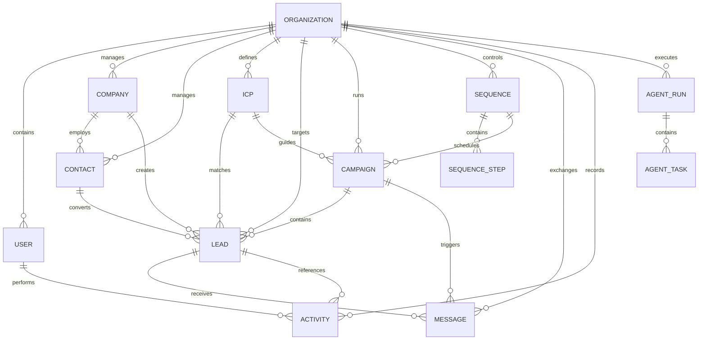

# LeadFlow AI Implementation Plan - Locked Architecture

This document defines the final, locked system architecture, database schema, API contracts, folder structure, and implementation plan for **LeadFlow AI**.

---

## 1. Final Prisma Schema

```prisma
datasource db {
  provider = "postgresql"
  url      = env("DATABASE_URL")
}

generator client {
  provider = "prisma-client-js"
}

enum UserRole {
  OWNER
  ADMIN
  MEMBER
}

enum LeadSource {
  APOLLO
  LINKEDIN
  CRUNCHBASE
  WEBSITE
  MANUAL
  IMPORT
  AGENT
}

enum LeadStatus {
  NEW
  RESEARCHING
  RESEARCHED
  ENRICHED
  CONTACTED
  RESPONDED
  BOUNCED
  CONVERTED
  NURTURING
  DISQUALIFIED
}

enum CampaignStatus {
  DRAFT
  ACTIVE
  PAUSED
  COMPLETED
}

enum CampaignType {
  EMAIL
  LINKEDIN
  MULTICHANNEL
}

enum MessageDirection {
  OUTBOUND
  INBOUND
}

enum MessageChannel {
  EMAIL
  LINKEDIN
}

enum MessageStatus {
  DRAFT
  QUEUED
  SENT
  DELIVERED
  OPENED
  CLICKED
  BOUNCED
  FAILED
}

enum ActorType {
  USER
  SYSTEM
  RESEARCH_AGENT
  SALES_AGENT
  CONTENT_AGENT
  REVIEW_AGENT
  ORCHESTRATOR
}

model Organization {
  id        String     @id @default(uuid()) @db.Uuid
  name      String
  slug      String     @unique
  createdAt DateTime   @default(now())
  updatedAt DateTime   @updatedAt

  users      User[]
  companies  Company[]
  contacts   Contact[]
  leads      Lead[]
  campaigns  Campaign[]
  messages   Message[]
  activities Activity[]
  icps       ICP[]
  sequences  Sequence[]
  agentRuns  AgentRun[]
}

model User {
  id             String       @id @default(uuid()) @db.Uuid
  clerkId        String       @unique
  email          String       @unique
  firstName      String?
  lastName       String?
  role           UserRole     @default(MEMBER)
  organizationId String       @db.Uuid
  organization   Organization @relation(fields: [organizationId], references: [id], onDelete: Cascade)
  createdAt      DateTime     @default(now())
  updatedAt      DateTime     @updatedAt

  activities Activity[]

  @@index([organizationId])
  @@index([createdAt])
}

model ICP {
  id             String       @id @default(uuid()) @db.Uuid
  organizationId String       @db.Uuid
  organization   Organization @relation(fields: [organizationId], references: [id], onDelete: Cascade)
  name           String
  industries     Json?
  employeeMin    Int?
  employeeMax    Int?
  countries      Json?
  buyerTitles    Json?
  technologies   Json?
  keywords       Json?
  createdAt      DateTime     @default(now())
  updatedAt      DateTime     @updatedAt

  leads     Lead[]
  campaigns Campaign[]

  @@index([organizationId])
  @@index([createdAt])
}

model Company {
  id             String       @id @default(uuid()) @db.Uuid
  organizationId String       @db.Uuid
  organization   Organization @relation(fields: [organizationId], references: [id], onDelete: Cascade)
  name           String
  domain         String?
  industry       String?
  size           String?
  location       String?
  website        String?
  linkedinUrl    String?
  description    String?
  createdAt      DateTime     @default(now())
  updatedAt      DateTime     @updatedAt

  contacts Contact[]
  leads    Lead[]

  @@unique([organizationId, domain])
  @@index([organizationId])
  @@index([createdAt])
}

model Contact {
  id             String       @id @default(uuid()) @db.Uuid
  organizationId String       @db.Uuid
  organization   Organization @relation(fields: [organizationId], references: [id], onDelete: Cascade)
  companyId      String?      @db.Uuid
  company        Company?     @relation(fields: [companyId], references: [id], onDelete: SetNull)
  firstName      String
  lastName       String?
  email          String?
  phone          String?
  jobTitle       String?
  linkedinUrl    String?
  location       String?
  createdAt      DateTime     @default(now())
  updatedAt      DateTime     @updatedAt

  leads Lead[]

  @@index([organizationId])
  @@index([companyId])
  @@index([createdAt])
}

model Lead {
  id             String       @id @default(uuid()) @db.Uuid
  organizationId String       @db.Uuid
  organization   Organization @relation(fields: [organizationId], references: [id], onDelete: Cascade)
  contactId      String       @db.Uuid
  contact        Contact      @relation(fields: [contactId], references: [id], onDelete: Cascade)
  companyId      String       @db.Uuid
  company        Company      @relation(fields: [companyId], references: [id], onDelete: Cascade)
  campaignId     String?      @db.Uuid
  campaign       Campaign?    @relation(fields: [campaignId], references: [id], onDelete: SetNull)
  icpId          String?      @db.Uuid
  icp            ICP?         @relation(fields: [icpId], references: [id], onDelete: SetNull)
  status         LeadStatus   @default(NEW)
  score          Float?
  source         LeadSource?
  sourceMetadata Json?
  enrichmentData Json?
  createdAt      DateTime     @default(now())
  updatedAt      DateTime     @updatedAt

  messages   Message[]
  activities Activity[]

  @@index([organizationId])
  @@index([contactId])
  @@index([companyId])
  @@index([campaignId])
  @@index([icpId])
  @@index([status])
  @@index([createdAt])
}

model Sequence {
  id             String       @id @default(uuid()) @db.Uuid
  organizationId String       @db.Uuid
  organization   Organization @relation(fields: [organizationId], references: [id], onDelete: Cascade)
  name           String
  description    String?
  createdAt      DateTime     @default(now())
  updatedAt      DateTime     @updatedAt

  steps     SequenceStep[]
  campaigns Campaign[]

  @@index([organizationId])
  @@index([createdAt])
}

model SequenceStep {
  id              String         @id @default(uuid()) @db.Uuid
  sequenceId      String         @db.Uuid
  sequence        Sequence       @relation(fields: [sequenceId], references: [id], onDelete: Cascade)
  stepNumber      Int
  type            MessageChannel
  delayDays       Int            @default(0)
  templateSubject String?
  templateBody    String
  createdAt       DateTime       @default(now())
  updatedAt       DateTime       @updatedAt

  @@index([sequenceId])
}

model Campaign {
  id             String         @id @default(uuid()) @db.Uuid
  organizationId String         @db.Uuid
  organization   Organization   @relation(fields: [organizationId], references: [id], onDelete: Cascade)
  icpId          String?        @db.Uuid
  icp            ICP?           @relation(fields: [icpId], references: [id], onDelete: SetNull)
  sequenceId     String?        @db.Uuid
  sequence       Sequence?      @relation(fields: [sequenceId], references: [id], onDelete: SetNull)
  name           String
  description    String?
  status         CampaignStatus @default(DRAFT)
  type           CampaignType   @default(EMAIL)
  settings       Json?
  createdAt      DateTime       @default(now())
  updatedAt      DateTime       @updatedAt

  leads    Lead[]
  messages Message[]

  @@index([organizationId])
  @@index([icpId])
  @@index([sequenceId])
  @@index([status])
  @@index([createdAt])
}

model Message {
  id             String           @id @default(uuid()) @db.Uuid
  organizationId String           @db.Uuid
  organization   Organization     @relation(fields: [organizationId], references: [id], onDelete: Cascade)
  campaignId     String?          @db.Uuid
  campaign       Campaign?        @relation(fields: [campaignId], references: [id], onDelete: SetNull)
  leadId         String           @db.Uuid
  lead           Lead             @relation(fields: [leadId], references: [id], onDelete: Cascade)
  direction      MessageDirection
  channel        MessageChannel
  subject        String?
  body           String
  status         MessageStatus    @default(DRAFT)
  sentAt         DateTime?
  createdAt      DateTime         @default(now())
  updatedAt      DateTime         @updatedAt

  @@index([organizationId])
  @@index([campaignId])
  @@index([leadId])
  @@index([status])
  @@index([createdAt])
}

model Activity {
  id             String       @id @default(uuid()) @db.Uuid
  organizationId String       @db.Uuid
  organization   Organization @relation(fields: [organizationId], references: [id], onDelete: Cascade)
  userId         String?      @db.Uuid
  user           User?        @relation(fields: [userId], references: [id], onDelete: SetNull)
  leadId         String?      @db.Uuid
  lead           Lead?        @relation(fields: [leadId], references: [id], onDelete: SetNull)
  actorType      ActorType
  type           String
  description    String
  metadata       Json?
  createdAt      DateTime     @default(now())

  @@index([organizationId])
  @@index([userId])
  @@index([leadId])
  @@index([createdAt])
}

model AgentRun {
  id             String       @id @default(uuid()) @db.Uuid
  organizationId String       @db.Uuid
  organization   Organization @relation(fields: [organizationId], references: [id], onDelete: Cascade)
  agentType      ActorType
  status         String
  duration       Int?
  tokensUsed     Int?
  startedAt      DateTime     @default(now())
  completedAt    DateTime?
  createdAt      DateTime     @default(now())
  updatedAt      DateTime     @updatedAt

  tasks AgentTask[]

  @@index([organizationId])
  @@index([createdAt])
}

model AgentTask {
  id            String    @id @default(uuid()) @db.Uuid
  agentRunId    String?   @db.Uuid
  agentRun      AgentRun? @relation(fields: [agentRunId], references: [id], onDelete: Cascade)
  payload       Json
  status        String
  assignedAgent ActorType
  resultSummary String?
  createdAt     DateTime  @default(now())
  updatedAt     DateTime  @updatedAt

  @@index([agentRunId])
  @@index([status])
}
```

---

## 2. PostgreSQL ER Diagram



---

## 3. Lead Generation Pipeline Flow

```
Company Discovery
        ↓
Company Enrichment
        ↓
Contact Discovery
        ↓
Contact Verification
        ↓
Lead Creation
        ↓
ICP Matching
        ↓
Campaign Assignment
        ↓
Sequence Assignment
        ↓
Outreach Execution
        ↓
Response Tracking
        ↓
CRM Pipeline
        ↓
Analytics
        ↓
Review Agent
```

---

## 4. Final Directory Structure

We use `npm workspaces` for root-level package management and type sharing.

```
/
├── apps/
│   ├── api/                       # NestJS Core Server
│   │   └── src/
│   │       ├── auth/              # Clerk Authentication Integration
│   │       ├── prisma/            # Shared Prisma Module & Client
│   │       ├── crm/               # CRM Domain Business Logic
│   │       │   ├── company/
│   │       │   ├── contact/
│   │       │   ├── lead/
│   │       │   ├── campaign/
│   │       │   ├── icp/
│   │       │   ├── sequence/
│   │       │   └── activity/
│   │       ├── research/          # Research Agent Module
│   │       ├── sales/             # Sales Agent Module
│   │       ├── content/           # Content Agent Module
│   │       ├── agents/            # Orchestrator & Run Management
│   │       │   ├── orchestrator/
│   │       │   ├── runs/
│   │       │   └── tasks/
│   │       └── analytics/         # Analytics Engine
│   │
│   └── web/                       # Next.js 15 App Router Frontend
│       └── src/
│           ├── app/
│           │   ├── dashboard/     # Unified Admin Metrics Dashboard
│           │   ├── companies/     # Companies Datagrid
│           │   ├── contacts/      # Contacts Datagrid
│           │   ├── leads/         # Lead Enrichment & Detail View
│           │   ├── campaigns/     # Sequences & Campaign Managers
│           │   └── settings/      # Org, Billing, & Settings
│           │
│           ├── components/        # Tailwind & Shadcn UI library
│           ├── hooks/             # Custom React Query & Zustand state bindings
│           └── lib/               # Axios / Client API contracts
│
├── packages/
│   ├── db/                        # Exposes Prisma Schema & Generated Client
│   ├── types/                     # Shared DTO classes and Interfaces
│   └── shared/                    # Eslint, Tsconfig, Logger configs
│
└── infrastructure/
    ├── docker/                    # Docker configs (PostgreSQL, Redis)
    ├── redis/                     # BullMQ & caching setup
    ├── supabase/                  # Local migrations & DB backups
    └── scripts/                   # DB seed templates and sync scripts
```


---

## 5. NestJS Module Boundaries

Each module inside the NestJS `crm` folder is encapsulated and communicates with others via clear service injection boundaries.

- **PrismaModule**: Global database connection sharing using `@nestjs/common` `Global()`.
- **AuthModule**: Handles Clerk JSON Web Token (JWT) extraction, decoding, and caching. Provides `@UseGuards(ClerkAuthGuard)`.
- **CrmModule**: Aggregates all CRM sub-modules (`CompanyModule`, `ContactModule`, `LeadModule`, `CampaignModule`, `IcpModule`, `SequenceModule`, `ActivityModule`, `AgentModule`).

---

## 6. REST API Contracts (`packages/types`)

All API interactions are strongly-typed via shared TS interfaces:

### Company Endpoints
- `POST /api/companies`: Create a company. Input: `CreateCompanyInput`.
- `GET /api/companies`: Fetch list of companies. Output: `CompanyDto[]`.

### Contact Endpoints
- `POST /api/contacts`: Create a contact. Input: `CreateContactInput`.
- `GET /api/contacts`: Fetch list of contacts. Output: `ContactDto[]`.

### Lead Endpoints
- `POST /api/leads`: Create a lead. Input: `CreateLeadInput`.
- `GET /api/leads`: Fetch list of leads. Output: `LeadDto[]`.

### ICP Endpoints
- `POST /api/icps`: Create/update ICP. Input: `CreateIcpInput`.
- `GET /api/icps`: List active ICPs. Output: `IcpDto[]`.

### Sequence Endpoints
- `POST /api/sequences`: Create outreach template sequence. Input: `CreateSequenceInput`.
- `GET /api/sequences`: List sequences. Output: `SequenceDto[]`.

---

## 7. Authentication Flow (Clerk Integration)

1. Client logins with Clerk SDK in the Frontend.
2. Clerk returns a JWT representing the active session.
3. Every outgoing frontend request includes the header: `Authorization: Bearer <clerk_jwt>`.
4. NestJS `ClerkAuthGuard` intercepts the request:
   - Validates JWT against Clerk's PEM key.
   - Extracts `clerkId`.
   - Looks up the `User` in PostgreSQL by `clerkId`.
   - Attaches `req.user` (containing our internal `id`, `organizationId`, and `role`) to the execution context.

---

## 8. Sprint 1 Implementation Checklist

- [ ] Initialize root monorepo configuration (`package.json`, `tsconfig.json`, workspaces mapping).
- [ ] Initialize `packages/types` and `packages/db`.
- [ ] Write the final Prisma schema to `packages/db/prisma/schema.prisma` and generate Prisma Client.
- [ ] Setup `apps/api` (NestJS). Install Clerk integration libraries.
- [ ] Setup NestJS CRM Modules: Company, Contact, Lead, Campaign, ICP, Sequence, Agent infrastructure.
- [ ] Setup `apps/web` (Next.js 15). Connect Clerk Frontend Provider and Shadcn styling.
- [ ] Develop dashboard mock interfaces representing leads list, campaign states, and ICP configurators.
- [ ] Run end-to-end smoke test verifying client-to-API communication.
